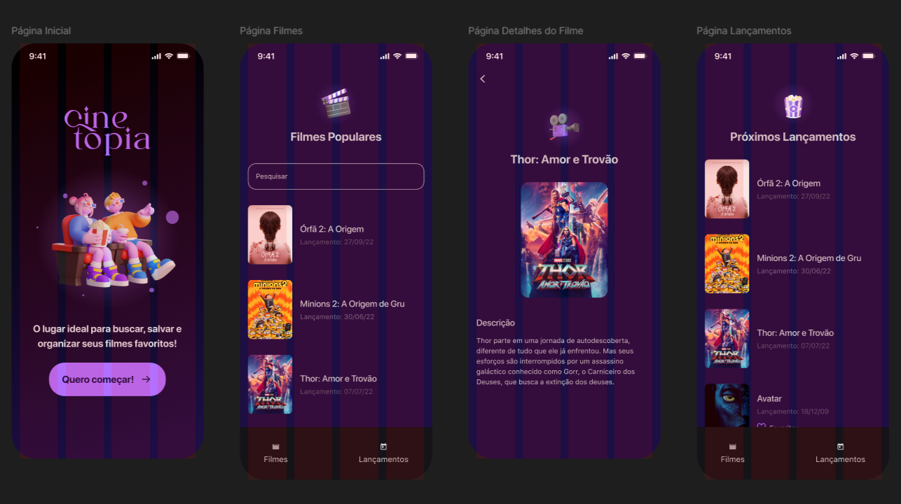

# 🎬 Cinetopia

<p align="center">
  
</p>
<p align="center">
  
</p>

O **Cinetopia** é um aplicativo mobile desenvolvido em Flutter para entusiastas do cinema. Ele permite explorar filmes populares, pesquisar títulos específicos e acompanhar os próximos lançamentos, tudo através de uma interface moderna e intuitiva integrada a uma API de filmes.

Este projeto foi desenvolvido durante a trilha de formação mobile da **Alura**, com foco em boas práticas de programação, arquitetura limpa e escalável e consumo de APIs REST.

---

## ✨ Funcionalidades

* **Página Inicial:** Tela de boas-vindas com design imersivo.
* **Busca Inteligente:** Pesquisa de filmes em tempo real com atualização de estado.
* **Catálogo de Populares:** Listagem dinâmica dos filmes mais assistidos.
* **Aba de Lançamentos:** Espaço dedicado para conferir as próximas estreias.
* **Detalhes do Filme:** Informações completas, incluindo sinopse e pôster em alta resolução.
* **Navegação Fluida:** Bottom Bar para alternar facilmente entre as seções.

---

## 🏗️ Arquitetura e Engenharia de Software

O projeto utiliza o padrão **MVVM (Model-View-ViewModel)**, garantindo a separação de responsabilidades entre a interface (UI) e a lógica de negócio. Além disso, segue rigorosamente os princípios do **SOLID** para garantir que o código seja testável, escalável e fácil de manter.

### 🛠️ O "Jeito Certo" de Escalar: Camada de Serviço
Um dos grandes destaques deste projeto está no arquivo `search_movies_service.dart`. Para evitar um código acoplado e difícil de crescer, utilizei uma **classe abstrata** como interface:

* **`SearchMoviesService` (Abstração):** Define o contrato para qualquer busca de filmes.
* **Implementações Específicas:** Criei classes dedicadas como `SearchPopularMoviesService`, `SearchForMovie` e `SearchForUpcomingMovies`.

> **Por que isso é importante?** Essa abordagem facilita a expansão do app. Se amanhã precisarmos buscar filmes por "Gênero" ou "Diretor", basta criar uma nova implementação da classe abstrata sem quebrar as funcionalidades existentes. É a aplicação real do **Princípio do Aberto/Fechado (Open/Closed Principle)**.

---

## 📁 Estrutura do Projeto

A organização das pastas reflete a separação de responsabilidades:

* **`lib/app/`**
    * `models/`: Definição de dados (`movie.dart`).
    * `services/`: Lógica de consumo de API.
    * `viewmodels/`: Ponte entre os dados e a interface.
    * `helpers/`: Constantes e configurações globais.
* **`lib/ui/`**
    * `components/`: Widgets reutilizáveis como `movie_card.dart` e botões.
    * `screens/`: As telas principais (Home, Dashboard, Search, Releases, Details).

---

## 🚀 Tecnologias Utilizadas

* **Flutter & Dart**.
* **http**: Para requisições assíncronas.
* **JSON Serialization**: Conversão de dados da API para objetos Dart.
* **Material Design 3**: UI moderna e responsiva.
* **TMDB API**: Fonte dos dados cinematográficos.

---

## 🔧 Como Executar

1. Clone o repositório.
2. Certifique-se de ter o Flutter instalado em sua máquina.
3. No terminal, execute:
   ```bash
   flutter pub get
4. Adicione sua chave de API no arquivo de constantes (configurado no .gitignore).
5. Execute o projeto:
6. ```bash
   flutter run


